# ShoppingList|Planner

This is a shopping list app project that was created using Python based Django framework. It is a very basic app that allows a user to perform full CRUD functionality i.e Create, Read, Update and Delete his data. The programming languages used for the development of this app are a combination of HTML, CSS & JavaScript for the front-end and Python based Django framework for the back-end development. 

The purpose of this app is to take off the hassle of manually writing down shopping list either for the home or office when going shopping. It rather automates this monotonous everyday task and gives the user the opportunity to reuse a single list over and over again by updating it as at when needed which gives it the added advantage over the manual pen & paper list thereby making shopping pleasurable and enjoyable. 

The user interacts with the app through the GUI interface i.e front-end templates designed for each functionality such as add, edit, view or delete an item/a list and are also protected through authentication so that no unauthorised person will have access to the contents in the list. 

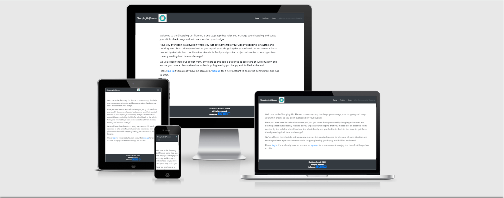

# Features

The ShoppingList|Planner app's strong point is the ability to instantly calculate the total price of an item based on the unit price & quantity a user enters when adding or updating the item to the list which makes the use of a calculator redundant. It aims to ease the stress that comes with shopping and its design is simple enough which makes it usable by any one irrespective of their age for their daily, weekly or monthly shopping.

# Existing Features

The features provided by the ShoppingList|Planner app are as follows:

* Create: A user can add a new item into the list 
* Read: A user can view the items in their list
* Update: A user can edit items in their list 
* Delete: A user can either remove an item from their list or delete an entire list.
* Sign Up: A user can register if he doesn't have an account yet before he can access any feature of the app
* Login: A user must be authenticated i.e logged in if he already has an account in 
order to be able to perform any action on his shoppinglist.
* Logout: A user can log out of his account to secure his shopping list

---

User Experience (UX)

* User stories

First Time User Goals

a) As a First Time Visitor, I want to easily understand the main purpose of the site and learn more about the app

b) As a First Time Visitor, I want to be able to sign up for an account in order to enjoy all the features of the app. 

c) As a First Time Visitor, I want to be able to access information through their social media links to see their followings on social media to determine how trusted and known the app is.

Registered User Goals

a) As a Registered User who is logged in, I want to be able to view my shopping list and see what items I have purchased and the ones left.

b) As a Registered User who is logged in, I want to be able to add a new item to my shopping list and view them during shopping.

c) As a Registered User, I want to be able to login to my account and add, view, modify or delete an item in my shopping list or delete my entire list.

d) As a Registered User who is logged in, I want to be able to mark an item in my list as either bought or unbought. toggle an item so that I can mark it as done when it's purchased. 

e) As a Registered User who is logged in, I want to be able to logout of my account to keep my information private and secure. 

f) As a Registered User who is logged in, I want to be able to retrieve and make changes on any item on my shopping list.  

g) As a Registered User who is logged in, I want to be able to remove a purchased item from the list to avoid the mistake of repurchasing it.

h) As a Registered User who is logged in, I want to be able to delete my list and have a blank space to start a new list.

i) As a Registered User who is logged in, I want to be able to enter my item's quantity and unit price and get the total price calculated and displayed automatically.

---

# Design

* Colour Scheme

The two main colours used are Black and White to get a good contrast, enhance usability and make users enjoy a great User experience. The background colour used for the navigation bar and footer sections are black with font colour of white for the texts while for the content area, the background colour used is white with font colour of black.

* Typography

The Lato font is the main font used throughout the whole website with Sans Serif as the fallback font in case for any reason the font isn't being imported into the site correctly. Lato is a clean font known for its round edges and the approachable warmth it gives to the reader and is used frequently in programming. It’s now one of the most popular fonts on Google font and widely used pretty much everywhere so it is both attractive and appropriate for my app.

* Imagery
Imagery is important. There is no background image used in this app in order to keep things simple and nice but an eye-catching shopping list image is used as a logo to catch the user's attention, add beauty to the app pages & subtly inform/remind the user that this is a shopping list planner app as they navigate around the app.

---

# Wireframes

For prototyping, the wireframes were designed manually by hand without using any automated tool in order to bring this idea to life. See screenshots below:

Welcome Page when User is not logged in or registered:
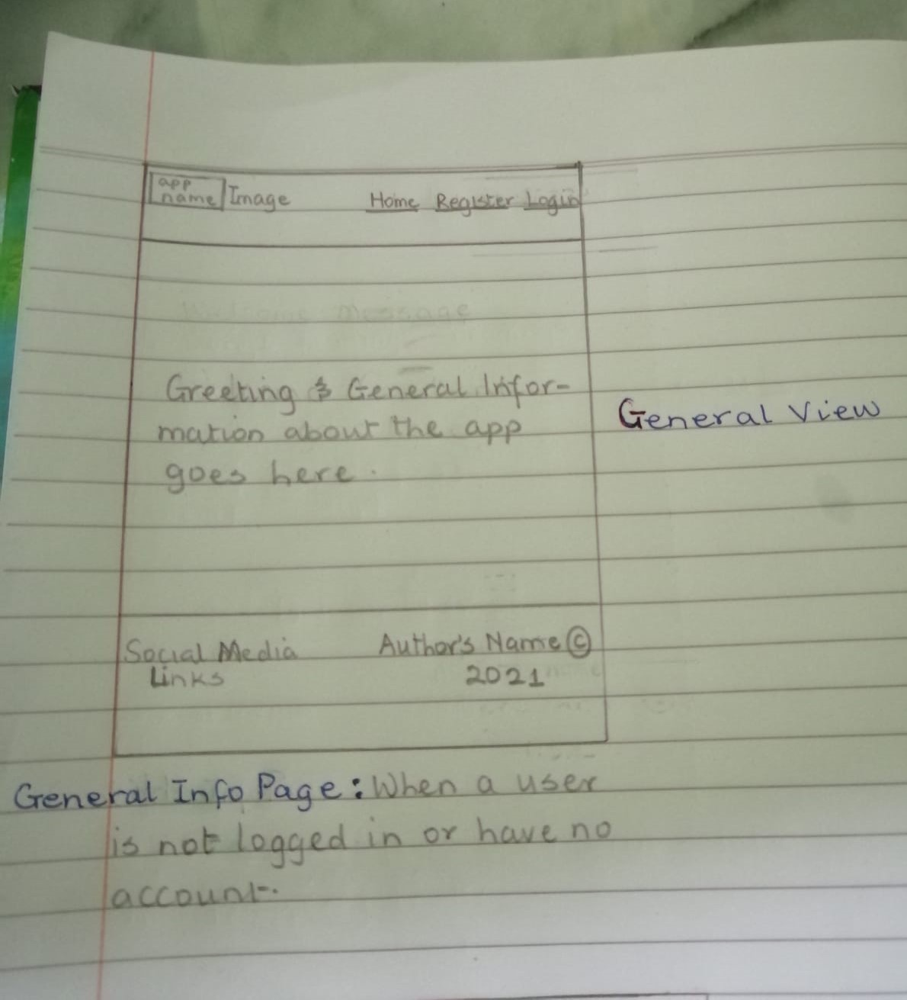

Create New Item Page when User is logged in: 
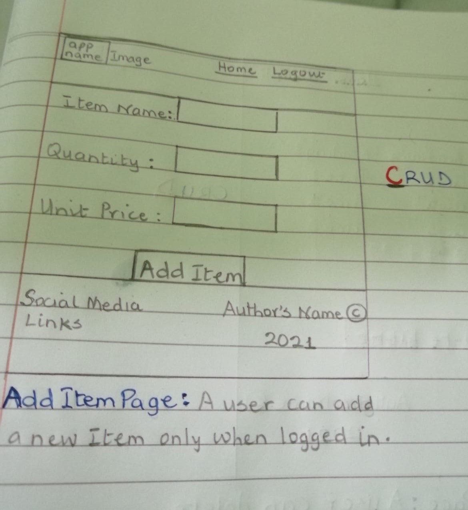

Read Item Page when User is logged in: 
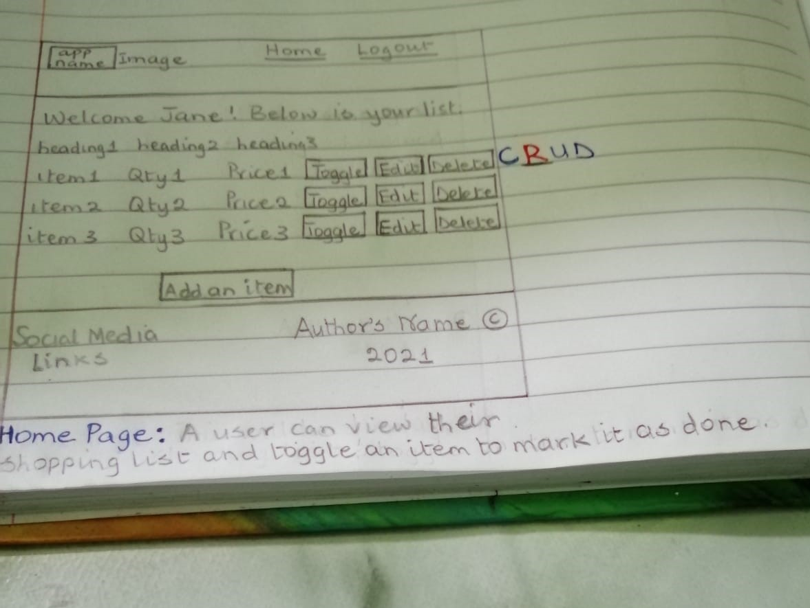

Update Item Page when User is logged in: 
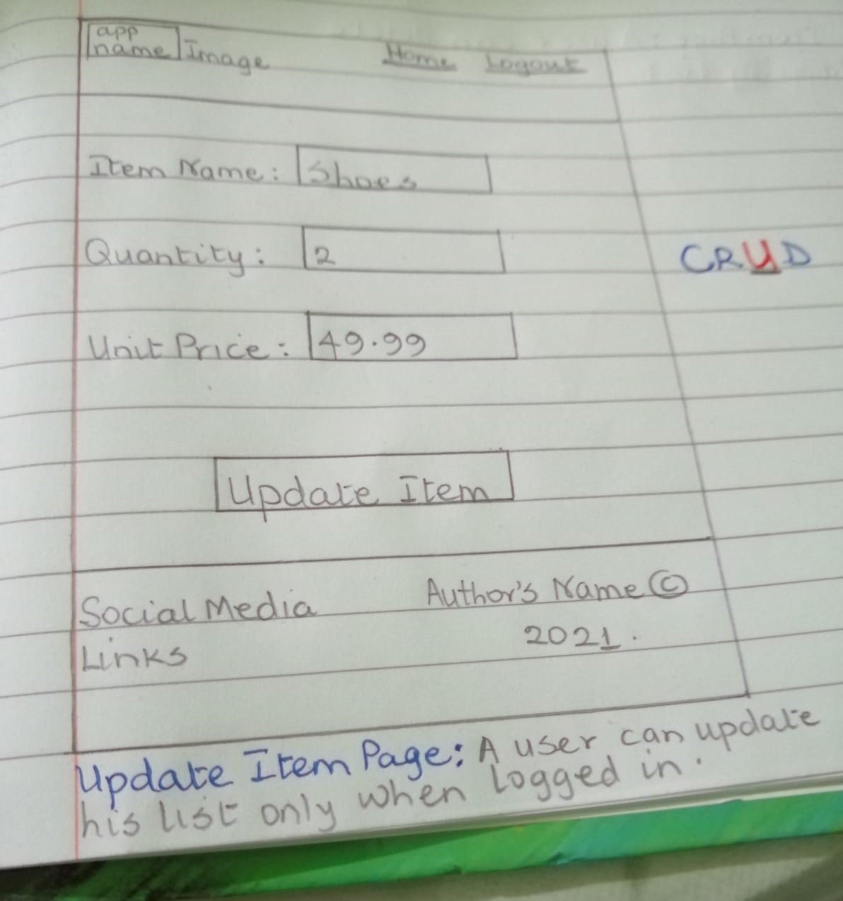

Delete Item/List Page when User is logged in: 
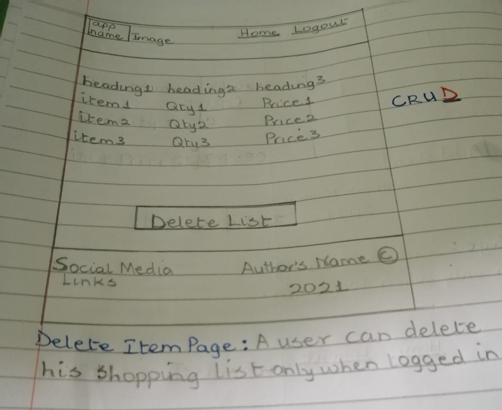

---

Agile Approach Used

* I used a [kanban board on GitHub](https://github.com/Eb0nY-April14/DjangoShoppingList/projects/1) as the agile planning tool for my Django app. A project was created in GitHub with issues and milestones set. I also used the MoSCoW labelling technique to prioritise my user stories into Must-Have, Should-Have, Could-Have and Won't-Have. At the start, I put all my user stories in the "To do" section of the board, then I moved the 3 Must-Haves into the "In progress" section and once I finished working on a functionality and everything responds as I want, I then move it to the "Done" section.

---

# Database Schema

The database schema for the ShoppingListItem Model is used to show the relationship between objects that exists within the said model i.e how they interact with each other. This relationship can either be one to one, one to many or many to many relationship but in this app, they are all one to one.

* View the database Schema below: 

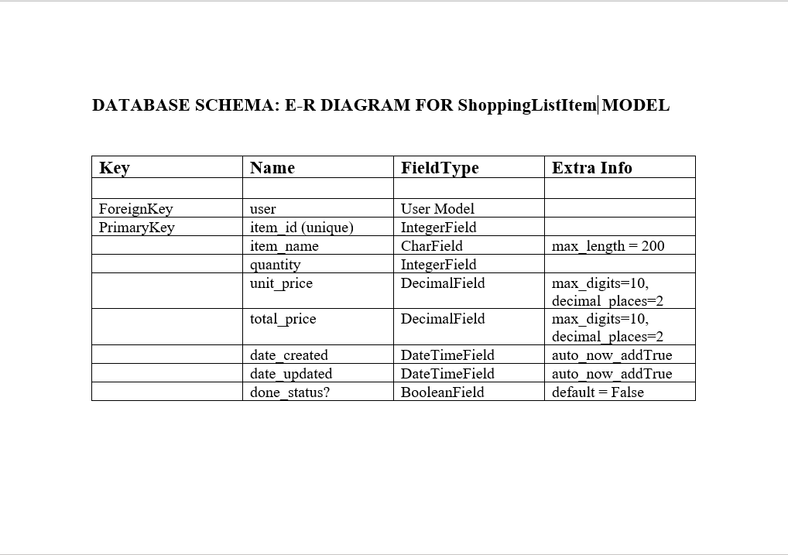

---

# Issues Encountered and Resolved

* I set up a JavaScript function to calculate the total price when a user adds or edits
an item. I added an event listener to the quantity input field to listen to an input change that comes from a user entering a value into any of these fields which then triggers the function accordingly. When I performed manual testing of this functionality, the total price was populated with zero which was the initial value I used as a placeholder for the total price so this was an indication that something was wrong with the function because the total price's value should change if the function works properly. I then added "console.log" to the inputs entered for the quantity, unit price and total price fields, opened the dev tool and inspected the console tab to check the printed outputs and discovered that only the value I entered for "quantity" was printed  to the console while the values printed for the other two fields were  "NaN" meaning "Not a Number". I proceeded on a mission to find out why this is happening and after much surfing of the internet and on a closer inspection, I discovered that it was because I added the event listener to the "quantity" field alone so once I entered that value, it writes every other field off and gives them a "NaN" value instead.
To solve this issue, in my forms.py file, I changed the order in which the fields were placed by putting the "unit price" above the "quantity". I also attached an event listener to the "unit price" field to listen for a change in that field too and it worked.
See screenshot below:

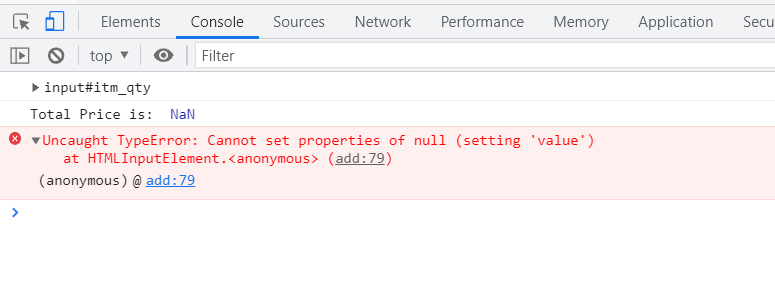

* Another issue encountered relates to the ids given to form inputs by Django and the ones I gave in my function. Since I used Django template form to set up my forms and Django builds the input fields automatically based on the fields I set up in my forms.py file and gives each an ID also. I didn't know that Django has already given all inputs their IDs so I gave each input element in my function another ID and during execution of the script, there was conflict so it had issues with "document.getElementById()" getting the ID I gave my message in order for the "Log in Successfully" message to be displayed to the user since that id doesn't exist. I was stuck on this issue for a long period without making a headway until I got in touch with tutor support who directed me to use the dev tools to inspect the IDs given to these elements by Django, copy them and replace the ones I have in my function with these copied IDs and when I did this, the problem was resolved as I used the "msg" id given by Django and total price was calculated rightly. 
I also had an issue with making the "Log in Successfully" message go away after 3 seconds of display and after much research & with tutor support, I discovered that in the JavaScript function, a mix of Django messaging template and bootstrap message alert were used which caused conflict between the two. I found a useful resource on stack overflow that helped me resolve the issue. See screenshot below:

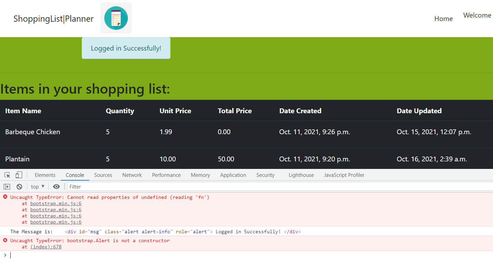

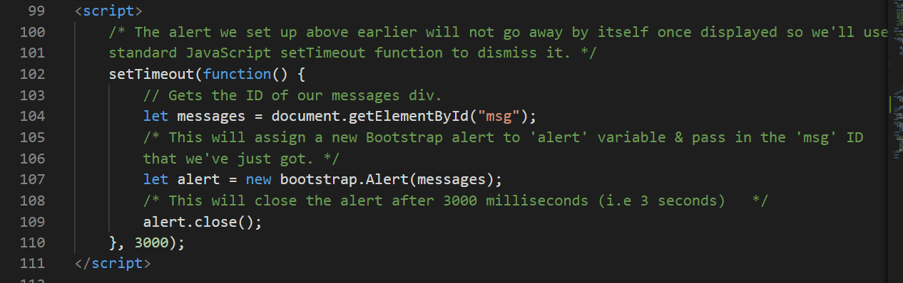

* When the code was run in Gitpod workspace, every part worked perfectly well but on the deployed site, Heroku, my static files were not loaded properly which affected my logo image and styling from displaying properly. I used cloudinary while setting up my app initially but it didn't work with my deployed app as shown in the screenshot below:

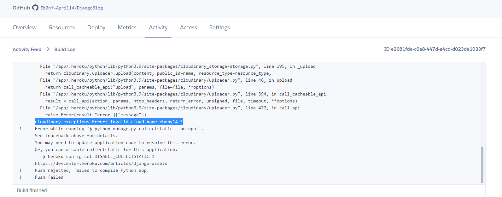

In a bid to find a solution to this issue, I searched online and found a very good resource on stackoverflow that talked about this package called "whitenoise" and how great it works with Heroku and efficient it is in simplifying static file serving for Python web apps. I went to their website to have a read, it's pretty simple to get it up and running and in 3 easy steps, it was installed and worked like magic in solving the issue. See links below:

[Link to stackoverflow](https://stackoverflow.com/questions/58611205/images-are-not-shown-on-my-heroku-website-static-files-are-loaded-fine)

[Link to WhiteNoise](http://whitenoise.evans.io/en/stable/)

---

# Technologies Used

* Languages Used

* HTML, CSS and JavaScript for front-end development

* Python for backend development

---

Frameworks, Libraries and Programs Used

1. Git

* Git was used for version control by utilising the Gitpod terminal to commit to Git and push to GitHub.

2. GitHub

* GitHub was used to store the project's code after being pushed from Git.

3. Bootstrap 4.1.3

* Bootstrap was used to assist with the responsiveness and styling of the website.

4. Django & Jinja templating Language

* The entire project anchors on this framework as it was used to build this app

5. Whitenoise

* Since Heroku can't serve static files on its own, this external package was installed and used to serve all the static files on Heroku as it works well with it. WhiteNoise allows the web app to serve its own static files, making it a self-contained unit that can be deployed anywhere without relying on nginx, Amazon S3 or any other external service.

6. Lato & Roboto Google Fonts:

* They were used on all pages throughout the project.

7. Font Awesome:

* Font Awesome was used on all pages throughout the app to add social media icons on the footer section for UX purpose.

8. jQuery:

* jQuery came with Bootstrap to make the navbar responsive.

9. Windows 10 built-in Photo Editor:

* This was used to resize the logo used on all page across the app.     

---

## Testing

To view all testing documentation, click to view the [TESTING.md](TESTING.md) file.

# Deployment

* Firstly, visit Heroku website to sign up for a free account at https://heroku.com/ 

* Create an account by clicking the "Sign Up" button and provide your details as required.

* Heroku sends an activation link to the email you provided so open that email, click on the link and it will take you to the Heroku site. 

* Enter your password and confirm it, then hit the "save" button.

* Heroku then takes you to the dashboard where you can create your first app

* To deploy this project to Heroku, there are four main stages involved which are:

1. Create the Heroku app

* To create your first app, you can either click on the "Create new app" button located in the middle of the page or on the "New" button located on the top right corner of the page and select "Create new app" option from the drop down box. Then, give your app a name and choose the region/location nearest to you e.g Europe and click on the "Create app" button. 

2. Attach the database

* To add a database, click on the "Resources" tab located at the top of the page. In the "Add-ons" section of the page, search for "postgres" using the search box provided and select "Heroku Postgres" to add it to your app. It then displays another popup box so click on the button provided and Heroku is added.

3. Prepare our environment and settings.py file

* Now that the database is added, go back to "Settings" tab located at the top of the page and click on "Reveal Config Vars" button. This will provide the "DATABASE_URL" which is the connection to your Postgres database so copy the string in the box beside the "DATABASE_URL" box and store it somewhere as it will be added to your project later.

* Go back to your code and in the same directory as the "manage.py" file, create a file called "env.py" which will be used to store your secret environment variables" while in development because this variable must be hidden and should not be publicly visible.       Add your "env.py" file to the ".gitignore" file so that when you push your code to GitHub, the secret environment variables and secret keys will not be visible for everyone to see. 

In the "env.py" file, import the os (operating system) library and use it to set a couple of environment variables which are:

i. Set "DATABASE_URL" and then paste in the URL copied from Heroku earlier i.e
os.environ["DATABASE_URL"] = "Paste in Heroku DATABASE_URL Link" 

ii. Add your secret key as this should not be visible on GitHub too. It will be made up by you and can comprise of whatever you like i.e
os.environ["SECRET_KEY"] = "Make up a randomSecretKey" 

iii. Save the file

* Copy the "SECRET_KEY" value above and add it to your "Config Vars" on Heroku so go back to Heroku dashboard, click on the "Settings" tab and under the "Config Vars" section, click on the "Reveal Config Vars" button once again. In the first pair of empty text box provided, type "SECRET_KEY" in one and its value copied earlier from "env.py" file into the other box i.e 
SECRET_KEY, “randomSecretKey”

* Click the "Add" button.

* Next, reference "env.py" file in the "settings.py" file and do a few imports so go back to "settings.py" file and at the top of the file and undrneath the first import (i.e from pathlib import Path), type the following to import them: 
import os
import dj_database_url
if os.path.isfile("env.py"):
import env

* In the "SECRET_KEY" section a little further down in the same file, remove the insecure secret key that is presently there and replace it with the new and secured "SECRET_KEY" i.e
SECRET_KEY = os.environ.get('SECRET_KEY')

* Then, wire up your Postgres Database. In "settings.py" file, scroll down to the "DATABASES" section and replace (Comment out the old DataBases Section) the current DATABASES Section with a new one as shown below:
DATABASES = {
'default':
dj_database_url.parse(os.environ.get("DATABASE_
URL"))
}

* At the terminal, make Migrations using the command: python3 manage.py migrate

* Save the file again and that's it! Heroku database is now being used as the backend.      

* Link file to the templates directory in Heroku i.e tell Django where your template will be stored so at the top of "settings.py" file and under the "BASE_DIR" directory/line, add:
TEMPLATES_DIR = os.path.join(BASE_DIR, 'templates')

* Scroll down midway in the "settings.py" file and change the "templates" directory to "TEMPLATES_DIR" i.e change the "DIRS" key inside the TEMPLATES  to point towards the new templates directory variable which is "TEMPLATES_DIR" i.e
'DIRS': [TEMPLATES_DIR]

* Add your Heroku Hostname to "ALLOWED_HOSTS" in the "settings.py" file which comprises of your Heroku app name followed by ".herokuapp.com", separate them with a comma and add beside it 'localhost'. The 'localhost' added will enable you run your app locally too i.e
ALLOWED_HOSTS = ["PROJ_NAME.herokuapp.com", "localhost"]

* Create 3 new folders at the same top level directory as manage.py file and name them media, static and templates

* Create another important file named Procfile on the top level directory as it contains information Heroku needs in order to know how to run your project.

* Open the Procfile and type the following line:
web: gunicorn PROJ_NAME.wsgi

* Save your Procfile and Add, Commit and Push to your repository using the following commands:
git add .
git commit -m “Deployment Commit”
git push

* Deploy Content manually through heroku e.g Github as deployment method, on main branch.
To do this, go back to your Heroku dashboard and click on the "Deploy" tab located at the top of the page. Under the "Deployment method" section,click on "GitHub" then search for your repository, select it and click on the "Connect" button beside it to connect your GitHub account to Heroku. 

* Next, scroll down to the bottom of the page and click on the "Deploy Branch" button and then click on the "View Build log" link in order to be able to watch the deployment as it's happening in the build log and it will pop this out in a full view page for you to see.

* If there is no error detected in the build, it displays a message of "Build finished" and a message which says "Your app has been deployed successfully".

* Click on the "Open app" button at the top right of the page to view your app.

View the live project [here](https://shoppinglist-planner.herokuapp.com/)

View the GitHub Repository [here](https://github.com/Eb0nY-April14/DjangoShoppingList)

---

# Credits

## Code

* Bootstrap4: Bootstrap Library used throughout the project mainly to make site responsive using the Bootstrap Grid System.

* Online Resources Used:
* Tutorial on Bootstrap Creative website at https://bootstrapcreative.com/can-adjust-text-size-bootstrap-responsive-design/

* YouTube video on Bootstrap 4 Grid System at https://www.youtube.com/watch?v=tX_4HTQ6Pgc&t=6s

* Tutorial on How to change image size in CSS? at https://www.javatpoint.com/oprweb/test.jsp?filename=how-to-change-image-size-in-css1

## Content

* Most contents were written by me with the exception of some pages which were taken from the course walkthroughs and Django built-in templates.

## Media

* No Image was used except the logo image which was obtained through Google search from this website https://depositphotos.com/vector-images/shopping-list.html  

---

# Acknowledgements

* My mentor Tim Nelson for his immense help, continuous guidance and feedback.

* Cohort Facilitator Kasia for her continuous help and support.

* The Community of Full Stack Frameworks Channel on Slack for their immense help

* Tutor Support at Code Institute for their support.

* Stack Overflow website for helpful resources especially on issues encountered with cloudinary and other django errors.

