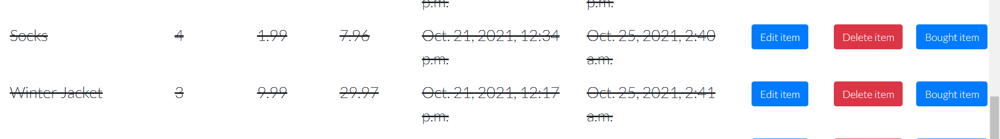

# ShoppingList|Planner

This is a shopping list app project that was created using Python based Django framework. It is a very basic app that allows a user to perform full CRUD functionality. The programming languages used for the development of this app are a combination of HTML, CSS & JavaScript for the front-end and Python based Django framework for the back-end development. It provides the following templates to the user:
i. 

The purpose of this app is to take off the hassle of manually writing down shopping list either for the home or office when going shopping. It rather automates this monotonous everyday task and gives the user the opportunity to reuse a single list over and over again by updating it as at when needed which gives it the added advantage over the manual pen & paper list thereby making shopping pleasurable and enjoyable. 
The user interacts with the app through the GUI interface i.e front-end templates designed for each functionality such as add, edit, view or delete an item/a list and are also protected through authentication so that no unauthorised person will have access to the contents in the list. 

# Features

The ShoppingList|Planner app's strong point is the ability to instantly calculate the total price of an item based on the unit price & quantity a user enters when adding or updating the item to the list which makes the use of a calculator redundant. It aims to ease the stress that comes with shopping and its design is simple enough which makes it usable by any one irrespective of their age for their daily, weekly or monthly shopping.

# Existing Features

The features provided by the ShoppingList|Planner app are as follows:

* Create: A user can add a new item into the list 
* Read: A user can view the items in their list
* Update: A user can edit items in their list 
* Delete: A user can either remove an item from their list or delete an entire list.
* Sign Up: A user can register if he doesn't have an account yet before he can access any feature of the app
* Login: A user must be authenticated i.e logged in if he already has an account in 
  order to be able to perform any action on his shoppinglist.
* Logout: A user can log out of his account to secure his shopping list

---

User Experience (UX)

* User stories

* User Goals

        a) As an Existing User who is logged in, I want to be able to view my shopping list and see what items I have purchased and the ones left.

        b) As an Existing User who is logged in, I want to be able to add a new item to my shopping list and view them during shopping.

        c) As an Existing User, I want to be able to login to my account and add, view, modify or delete an item in my shopping list or delete my entire list.

        d) As an Existing User who is logged in, I want to be able to mark an item in my list as either bought or unbought. toggle an item so that I can mark it as done when it's purchased. 

        e) As a First time User, I want to be able to sign up for an account in order to enjoy all the features of the app. 
        
        f) As an Existing User, I want to be able to logout of my account to keep my information private and secure. 
        
        g) As an Existing User, I want to be able to retrieve and make changes on any item on my shopping list.  

        h) As an Existing User, I want to be able to remove a purchased item from the list to avoid the mistake of repurchasing it.

        i) As an Existing User, I want to be able to delete my list and have a blank space to start a new list.
        
        j) As an Existing User, I want to be able to enter my item's quantity and unit price and get the total price calculated and displayed automatically.
        
# Database Schema

The database schema for the ShoppingListItem Model is used to show the relationship between objects that exists within the said model i.e how they interact with each other. This relationship can either be one to one, one to many or many to many relationship but in this app, they are all one to one.

* View the database Schema below: 

# Technologies Used

* Languages & Framework Used

  * HTML, CSS, JavaScript and Bootstrap for front-end development

  * Python and Django framework for backend development

---

* Issues Encountered and Resolved

    * I set up a JavaScript function to calculate the total price when a user adds or edits
    an item. I added an event listener to the quantity input field to listen to an input change that comes from a user entering a value into any of these fields which then triggers the function accordingly. When I performed manual testing of this functionality, the total price was populated with zero which was the initial value I used as a placeholder for the total price so this was an indication that something was wrong with the function because the total price's value should change if the function works properly. I then added "console.log" to the inputs entered for the quantity, unit price and total price fields, opened the dev tool and inspected the console tab to check the printed outputs and discovered that only the value I entered for "quantity" was printed  to the console while the values printed for the other two fields were  "NaN" meaning "Not a Number". I proceeded on a mission to find out why this is happening and after much surfing of the internet and on a closer inspection, I discovered that it was because I added the event listener to the "quantity" field alone so once I entered that value, it writes every other field off and gives them a "NaN" value instead.
    To solve this issue, in my forms.py file, I changed the order in which the fields were placed by putting the "unit price" above the "quantity". I also attached an event listener to the "unit price" field to listen for a change in that field too and it worked.
    See screenshot below:

    

    * Another issue encountered relates to the ids given to form inputs by Django and the ones I gave in my function. Since I used Django template form to set up my forms and Django builds the input fields automatically based on the fields I set up in my forms.py file and gives each an ID also. I didn't know about this Django ID so I gave each input element in my function another ID and during execution of the script, it had issues getting them since they don't exist. I was stuck on this issue for a long period without making a headway until I got in touch with tutor support who directed me to use the dev tools to inspect the IDs given to these elements by Django, copy them and replace the ones I have in my function with these copied IDs and when I did this, the problem was resolved and total price was calculated rightly.

    * When the code was run in Gitpod workspace, every part worked perfectly well but on the deployed site, Heroku, my static files were not loaded properly which affected my logo image and styling from displaying properly. I used cloudinary while setting up my app initially but it didn't work with my deployed app so I googled to find out the solution to this issue and found a very good article on stackoverflow that talked about this package called "whitenoise" and how great it works with Heroku and efficient it is in simplifying static file serving for Python web apps. I went to their website to have a read, it's pretty simple to get it up and running and in 3 easy steps, it was installed and worked like magic in solving the issue. See links below:

    [Link to stackoverflow](https://stackoverflow.com/questions/58611205/images-are-not-shown-on-my-heroku-website-static-files-are-loaded-fine)

    [Link to WhiteNoise](http://whitenoise.evans.io/en/stable/)

    Frameworks, Libraries and Programs Used

1. Git

    * Git was used for version control by utilising the Gitpod terminal to commit to Git and push to GitHub.

2. GitHub

    * GitHub was used to store the project's code after being pushed from Git.

3. Bootstrap

  * Bootstrap 4 was used for styling

4. Django

  * The entire project anchors on this framework as it was used to build this app

5. Whitenoise

  * Since Heroku can't serve static files on its own, this external package was installed and used to serve all the static files on Heroku as it works well with it. WhiteNoise allows the web app to serve its own static files, making it a self-contained unit that can be deployed anywhere without relying on nginx, Amazon S3 or any other external service.

## Testing

PEP8 online validation tool was used to validate the code to ensure there were no syntax errors or improper code indentation. It passed the test as seen in the screenshot below:

### Testing User Stories from User Experience (UX) Section

i. As an Existing User who is logged in, I want to be able to view my shopping list and see what items I have purchased and the ones left. 

    a. User logs in and if successful, he is redirected to the home page where he can view his shopping list as seen in the screenshots below:

---

ii. As an Existing User who is logged in, I want to be able to add a new item to my shopping list and view them during shopping.

    a. User logs in and if successful, he is redirected to the home page where the "Add an item" button is located at the bottom of the page. See screenshot below: 

    
    b. On clicking the add button, he is taken to the add item's form page and if he fills the form and submits it, the new item is added to the shopping list in the database and he is taken back to the home page where he'll see his newly added item. See the screenshots below:  

---

iii. As an Existing User, I want to be able to login to my account and add, view, modify or delete an item in my shopping list or delete my entire list.

    a. When a user clicks on the app link or copies it into any search box such as Google, he lands on the welcome page. At the top right side of this page are the nav links, one of which is the "Login" link as seen in the screenshot below:

    
    b. When he clicks on the "Login" link, he is taken to the login form page where he can fill in his details as seen in the screenshot below: 

---

iv. As an Existing User who is logged in, I want to be able to mark an item in my list as either bought or unbought. 

    a. The third button beside each item on the home/viewing page is the one for toggling an item to mark it as either done when it's purchased or not. When the button is clicked, it strikes out the item as "bought" and is moved to the bottom of the row and if clicked again, the "strike out" mark is removed & the item is moved back up which means it hasn't been bought yet. See screenshot below:

Items marked as unbought: 

Items marked as bought: 

---

v. As a First time User, I want to be able to sign up for an account in order to enjoy all the features of the app. 

    a. When a user clicks on the app link or copies it into any search box such as Google, he lands on the welcome page. At the top right side of this page are the nav links, one of which is the "Register" link as seen in the screenshot below:

    
    b. If he clicks on the "Register" link, he is taken to the "Sign Up" form page where he can fill in his details as seen in the screenshot below: 

 

---

vi. As an Existing User, I want to be able to logout of my account to keep my information private and secure.

    a. The "Logout" link is displayed to the user on the nav bar at the top right side of the home page once he is authenticated. See screenshot below:

    b. When he clicks on the "Logout" link, he is logged out of his account and a message is displayed to confirm his successful logout operation as seen in the screenshot below:

 

---

vii. As an Existing User, I want to be able to retrieve and make changes on any item on my shopping list.

    a. The first button beside each item on the home/viewing page is the "Edit item" button which the User needs for updating an item in the database as shown in the screenshot below: 

    
    b. On clicking the "Edit item" button, the User is taken to the edit item's form page where the input fields are prepopulated with their current values in the database and waiting for the user to make changes to the relevant field(s). After making his desired changes, he clicks on the "Update item" button and the changes are made in the database and user is redirected back to the home page to view his shopping list in order to confirm that the changes has actually been made. See screenshot below:

