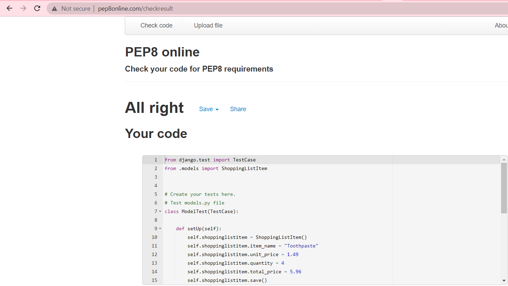
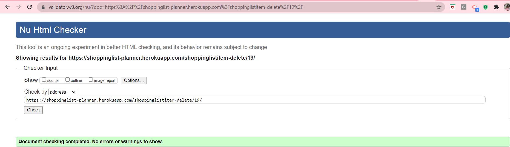
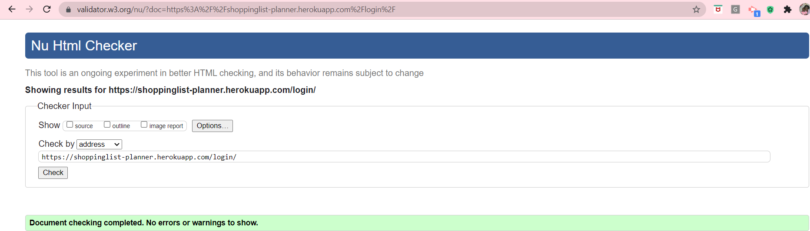

# ShoppingList|Planner

This is a shopping list app project that was created using Python based Django framework. It is a very basic app that allows a user to perform full CRUD functionality. The programming languages used for the development of this app are a combination of HTML, CSS & JavaScript for the front-end and Python based Django framework for the back-end development. It provides the following templates to the user:
i. 

The purpose of this app is to take off the hassle of manually writing down shopping list either for the home or office when going shopping. It rather automates this monotonous everyday task and gives the user the opportunity to reuse a single list over and over again by updating it as at when needed which gives it the added advantage over the manual pen & paper list thereby making shopping pleasurable and enjoyable. 
The user interacts with the app through the GUI interface i.e front-end templates designed for each functionality such as add, edit, view or delete an item/a list and are also protected through authentication so that no unauthorised person will have access to the contents in the list. 

# Features

The ShoppingList|Planner app's strong point is the ability to instantly calculate the total price of an item based on the unit price & quantity a user enters when adding or updating the item to the list which makes the use of a calculator redundant. It aims to ease the stress that comes with shopping and its design is simple enough which makes it usable by any one irrespective of their age for their daily, weekly or monthly shopping.

# Existing Features

The features provided by the ShoppingList|Planner app are as follows:

* Create: A user can add a new item into the list 
* Read: A user can view the items in their list
* Update: A user can edit items in their list 
* Delete: A user can either remove an item from their list or delete an entire list.
* Sign Up: A user can register if he doesn't have an account yet before he can access any feature of the app
* Login: A user must be authenticated i.e logged in if he already has an account in 
  order to be able to perform any action on his shoppinglist.
* Logout: A user can log out of his account to secure his shopping list

---

User Experience (UX)

* User stories

* User Goals

        a) As an Existing User who is logged in, I want to be able to view my shopping list and see what items I have purchased and the ones left.

        b) As an Existing User who is logged in, I want to be able to add a new item to my shopping list and view them during shopping.

        c) As an Existing User, I want to be able to login to my account and add, view, modify or delete an item in my shopping list or delete my entire list.

        d) As an Existing User who is logged in, I want to be able to mark an item in my list as either bought or unbought. toggle an item so that I can mark it as done when it's purchased. 

        e) As a First time User, I want to be able to sign up for an account in order to enjoy all the features of the app. 
        
        f) As an Existing User, I want to be able to logout of my account to keep my information private and secure. 
        
        g) As an Existing User, I want to be able to retrieve and make changes on any item on my shopping list.  

        h) As an Existing User, I want to be able to remove a purchased item from the list to avoid the mistake of repurchasing it.

        i) As an Existing User, I want to be able to delete my list and have a blank space to start a new list.
        
        j) As an Existing User, I want to be able to enter my item's quantity and unit price and get the total price calculated and displayed automatically.

Agile Approach Used

* I used a kanban board on GitHub as the agile planning tool for my Django app. A project was created in GitHub with issues and milestones set. I also used the MoSCoW labelling technique to prioritise my user stories into Must-Have, Should-Have, Could-Have and Won't-Have. At the start, I put all my user stories in the "To do" section of the board, then I moved the 3 Must-Haves into the "In progress" section and once I finished working on a functionality and everything responds as I want, I then move it to the "Done" section.
        
# Database Schema

The database schema for the ShoppingListItem Model is used to show the relationship between objects that exists within the said model i.e how they interact with each other. This relationship can either be one to one, one to many or many to many relationship but in this app, they are all one to one.

* View the database Schema below: 

# Technologies Used

* Languages & Framework Used

  * HTML, CSS, JavaScript and Bootstrap for front-end development

  * Python and Django framework for backend development

---

* Issues Encountered and Resolved

    * I set up a JavaScript function to calculate the total price when a user adds or edits
    an item. I added an event listener to the quantity input field to listen to an input change that comes from a user entering a value into any of these fields which then triggers the function accordingly. When I performed manual testing of this functionality, the total price was populated with zero which was the initial value I used as a placeholder for the total price so this was an indication that something was wrong with the function because the total price's value should change if the function works properly. I then added "console.log" to the inputs entered for the quantity, unit price and total price fields, opened the dev tool and inspected the console tab to check the printed outputs and discovered that only the value I entered for "quantity" was printed  to the console while the values printed for the other two fields were  "NaN" meaning "Not a Number". I proceeded on a mission to find out why this is happening and after much surfing of the internet and on a closer inspection, I discovered that it was because I added the event listener to the "quantity" field alone so once I entered that value, it writes every other field off and gives them a "NaN" value instead.
    To solve this issue, in my forms.py file, I changed the order in which the fields were placed by putting the "unit price" above the "quantity". I also attached an event listener to the "unit price" field to listen for a change in that field too and it worked.
    See screenshot below:

    

    * Another issue encountered relates to the ids given to form inputs by Django and the ones I gave in my function. Since I used Django template form to set up my forms and Django builds the input fields automatically based on the fields I set up in my forms.py file and gives each an ID also. I didn't know that Django has already given all inputs their IDs so I gave each input element in my function another ID and during execution of the script, there was conflict so it had issues with "document.getElementById()" getting the ID I gave my message in order for the "Log in Successfully" message to be displayed to the user since that id doesn't exist. I was stuck on this issue for a long period without making a headway until I got in touch with tutor support who directed me to use the dev tools to inspect the IDs given to these elements by Django, copy them and replace the ones I have in my function with these copied IDs and when I did this, the problem was resolved as I used the "msg" id given by Django and total price was calculated rightly. 
    I also had an issue with making the "Log in Successfully" message go away after 3 seconds of display and after much research & with tutor support, I discovered that in the JavaScript function, a mix of Django messaging template and bootstrap message alert were used which caused conflict between the two. I found a useful resource on stack overflow that helped me resolve the issue. See screenshot below:

    * When the code was run in Gitpod workspace, every part worked perfectly well but on the deployed site, Heroku, my static files were not loaded properly which affected my logo image and styling from displaying properly. I used cloudinary while setting up my app initially but it didn't work with my deployed app as shown in the screenshot below:

    
    In a bid to find a solution to this issue, I searched online and found a very good resource on stackoverflow that talked about this package called "whitenoise" and how great it works with Heroku and efficient it is in simplifying static file serving for Python web apps. I went to their website to have a read, it's pretty simple to get it up and running and in 3 easy steps, it was installed and worked like magic in solving the issue. See links below:

    [Link to stackoverflow](https://stackoverflow.com/questions/58611205/images-are-not-shown-on-my-heroku-website-static-files-are-loaded-fine)

    [Link to WhiteNoise](http://whitenoise.evans.io/en/stable/)

    ---

    Frameworks, Libraries and Programs Used

1. Git

    * Git was used for version control by utilising the Gitpod terminal to commit to Git and push to GitHub.

2. GitHub

    * GitHub was used to store the project's code after being pushed from Git.

3. Bootstrap

  * Bootstrap 4 was used for styling

4. Django

  * The entire project anchors on this framework as it was used to build this app

5. Whitenoise

  * Since Heroku can't serve static files on its own, this external package was installed and used to serve all the static files on Heroku as it works well with it. WhiteNoise allows the web app to serve its own static files, making it a self-contained unit that can be deployed anywhere without relying on nginx, Amazon S3 or any other external service.

## Testing

PEP8 online validator

This tool was used to validate my .py files to ensure there are no syntax errors or improper code indentation. They passed the test as seen in the screenshots below:

* urls.py:

* models.py:

* views.py:

* apps.py:

* forms.py:

* tests.py:

w3html validator 

This tool was used to validate all my html templates and I got warning on 6 pages while the 7th page showed a warning & 3 errors. The html validator showed errors regarding the sign up page in which I used the Django built in form i.e {{ form.as_p }}. Here below are the screenshots of the 6 error free templates and the last one with errors:

* Add item Page:

* Home/View list Page:

* Edit item Page:

* Delete item Page:

* Login Page:

* Logout Page:

* Register/Sign Up Page:

    * There were some errors found in the register page that has to do with the Django built in form template used. Since we were told not to reinvent the wheel but just customise Django's built in pages that already exists and are tested, I did so by using the {{ form.as_p }} but the html validator is complaining about it and this is beyond my control to fix so that's the reason why I'm leaving the errors in as seen in the screenshots below:

w3CSS validator

This tool was used to validate my custom css code and it passed successfully. See screenshot below:

* Custom CSS (style.css):

### Manual Testing of shoppinglist|planner app Functionalities 

* Testing User Stories from User Experience (UX) Section

i. As an Existing User who is logged in, I want to be able to view my shopping list and see what items I have purchased and the ones left. 

    a. User logs in and if successful, he is redirected to the home page where he can view his shopping list as seen in the screenshots below:

---

ii. As an Existing User who is logged in, I want to be able to add a new item to my shopping list and view them during shopping.

    a. The User will find the "Add an item" button close to the footer section of the home page. See screenshot below: 

    
    b. On clicking the "Add an item" button, he is taken to the add item's form page and if he fills the form and submits it, the new item is added to the shopping list in the database and he is taken back to the home page where he'll see his newly added item. See the screenshots below:  

---

iii. As an Existing User, I want to be able to login to my account and add, view, modify or delete an item in my shopping list or delete my entire list.

    a. When a user clicks on the app link or copies it into any search box such as Google, he lands on the welcome page. At the top right side of this page are the nav links, one of which is the "Login" link as seen in the screenshot below:

    
    b. When he clicks on the "Login" link, he is taken to the login form page where he can fill in his details and if correct, he logs in successfully. See screenshot below: 

---

iv. As an Existing User who is logged in, I want to be able to mark an item in my list as either bought or unbought. 

    a. The third button beside each item on the home/viewing page is the one for toggling an item to mark it as either done when it's purchased or not. When the button is clicked, it strikes out the item as "bought" and is moved to the bottom of the row and if clicked again, the "strike out" mark is removed & the item is moved back up which means it hasn't been bought yet. See screenshot below:

Items marked as unbought: 

Items marked as bought: 

---

v. As a First time User, I want to be able to sign up for an account in order to enjoy all the features of the app. 

    a. When a user clicks on the app link or copies it into any search box such as Google, he lands on the welcome page. At the top right side of this page are the nav links, one of which is the "Register" link as seen in the screenshot below:

    
    b. If he clicks on the "Register" link, he is taken to the "Sign Up" form page where he can fill in his details as seen in the screenshot below: 

 

---

vi. As an Existing User, I want to be able to logout of my account to keep my information private and secure.

    a. The "Logout" link is displayed to the user on the nav bar at the top right side of the home page once he is authenticated. See screenshot below:

    b. When he clicks on the "Logout" link, he is logged out of his account and a message is displayed to confirm his successful logout operation as seen in the screenshot below:

 

---

vii. As an Existing User, I want to be able to retrieve and make changes on any item on my shopping list.

    a. The first button beside each item on the home/viewing page is the "Edit item" button which the User needs for updating an item in the database as shown in the screenshot below: 

    
    b. On clicking the "Edit item" button, the User is taken to the edit item's form page where the input fields are prepopulated with their current values in the database and waiting for the user to make changes to the relevant field(s). After making his desired changes, he clicks on the "Update item" button and the changes are made in the database and user is redirected back to the home page to view his shopping list in order to confirm that the changes has actually been made. See screenshot below:

---

viii. As an Existing User, I want to be able to remove a purchased item from the list to avoid the mistake of repurchasing it.

    a. The second button beside each item on the home/viewing page is the "Delete item" button which the User needs for removing/deleting an item in the database as shown in the screenshot below: 

      
    b. When he clicks on the "Delete item" button, another page that contains a confirmation message is displayed to the user and if he confirms with the "Delete item" button again, the item is removed from the database. See screenshot below:

---

ix. As an Existing User, I want to be able to delete my list and have a blank space to start a new list.

    a. The User will find the "Delete List" button beside the "Add an item" button close to the footer section of the home page and if clicked, the entire shopping list is deleted outrightly and a blank page is displayed back to the user to show that his list has been deleted. See screenshot below: 

---

x. As an Existing User, I want to be able to enter my item's quantity and unit price and get the total price calculated and displayed automatically.

    a. When the "Add an item" form page is displayed to the User, he enters the item name, unit price and quantity in the appropriate fields and when he moves the cursor into the input box for the total price field, it automatically gets populated with the total price for that particular item as seen in the screenshot below:

 

    b. Similar process as "Add an item" also goes for the "Edit an item" operation. Find below the screenshot taken before the item was updated:

 
    
    c. When the User changes the values for both the "unit price" and "quantity", the total price is automatically calculated and its field populated with the right amount as seen in the screenshot below: 

 

    d.  When the User changes the value for the "unit price" only, the total price is automatically calculated and its field populated with the right amount as seen in the screenshot below: 

 

    e. When the User changes the value for the "quantity" only, the total price is automatically calculated and its field populated with the right amount as seen in the screenshot below: 

 

---

### Manual Testing of JavaScript function that calculates the total price of an item. 

When a user adds a new item or edits one, this function calculates the total price automatically and populates the "total_price" field with the result. The screenshots below are the add item and edit item templates and the calculated & prepopulated value of total price showing that it is calculated correctly. 

    i. add item Page:

    ii. edit item Page before the edit operation:

    iii. edit item Page after the edit operation:

---

# Deployment

* Firstly, visit Heroku website to sign up for a free account at https://heroku.com/ 

* Create an account by clicking the "Sign Up" button and provide your details as required.

* Heroku sends an activation link to the email you provided so open that email, click on the link and it will take you to the Heroku site. 

* Enter your password and confirm it, then hit the "save" button.

* Heroku then takes you to the dashboard where you can create your first app

* To deploy this project to Heroku, there are four main stages involved which are:

1. Create the Heroku app

    * To create your first app, you can either click on the "Create new app" button located in the middle of the page or on the "New" button located on the top right corner of the page and select "Create new app" option from the drop down box. Then, give your app a name and choose the region/location nearest to you e.g Europe and click on the "Create app" button. 

2. Attach the database

    * To add a database, click on the "Resources" tab located at the top of the page. In the "Add-ons" section of the page, search for "postgres" using the search box provided and select "Heroku Postgres" to add it to your app. It then displays another popup box so click on the button provided and Heroku is added.

3. Prepare our environment and settings.py file

    * Now that the database is added, go back to "Settings" tab located at the top of the page and click on "Reveal Config Vars" button. This will provide the "DATABASE_URL" which is the connection to your Postgres database so copy the string in the box beside the "DATABASE_URL" box and store it somewhere as it will be added to your project later.

    * Go back to your code and in the same directory as the "manage.py" file, create a file called "env.py" which will be used to store your secret environment variables" while in development because this variable must be hidden and should not be publicly visible.       Add your "env.py" file to the ".gitignore" file so that when you push your code to GitHub, the secret environment variables and secret keys will not be visible for everyone to see. 
    
    In the "env.py" file, import the os (operating system) library and use it to set a couple of environment variables which are:

        i. Set "DATABASE_URL" and then paste in the URL copied from Heroku earlier i.e
        os.environ["DATABASE_URL"] = "Paste in Heroku DATABASE_URL Link" 

        ii. Add your secret key as this should not be visible on GitHub too. It will be made up by you and can comprise of whatever you like i.e
        os.environ["SECRET_KEY"] = "Make up a randomSecretKey" 

        iii. Save the file

    * Copy the "SECRET_KEY" value above and add it to your "Config Vars" on Heroku so go back to Heroku dashboard, click on the "Settings" tab and under the "Config Vars" section, click on the "Reveal Config Vars" button once again. In the first pair of empty text box provided, type "SECRET_KEY" in one and its value copied earlier from "env.py" file into the other box i.e 
    SECRET_KEY, “randomSecretKey”

    * Click the "Add" button.

    * Next, reference "env.py" file in the "settings.py" file and do a few imports so go back to "settings.py" file and at the top of the file and undrneath the first import (i.e from pathlib import Path), type the following to import them: 
        import os
        import dj_database_url
        if os.path.isfile("env.py"):
            import env

    * In the "SECRET_KEY" section a little further down in the same file, remove the insecure secret key that is presently there and replace it with the new and secured "SECRET_KEY" i.e
    SECRET_KEY = os.environ.get('SECRET_KEY')

    * Then, wire up your Postgres Database. In "settings.py" file, scroll down to the "DATABASES" section and replace (Comment out the old DataBases Section) the current DATABASES Section with a new one as shown below:
        DATABASES = {
        'default':
        dj_database_url.parse(os.environ.get("DATABASE_
        URL"))
        }

    * At the terminal, make Migrations using the command: python3 manage.py migrate

    * Save the file again and that's it! Heroku database is now being used as the backend.      

4. Get our static and media files stored on Cloudinary

    * Firstly, set up a Cloudinary account by following these steps: 
        i.   Visit the Cloudinary website: https://cloudinary.com/
        ii.  Click on the Sign Up For Free button
        iii. Provide your name, email address and choose a password
        iv.  For Primary interest, you can choose Programmable Media for image and video API
        v.   Optional: edit your assigned cloud name to something more memorable
        vi.  Click Create Account
        vii. Verify your email and you will be brought to the dashboard

    * Once account is cretaed, go over to the dashboard which contains the API authentication information and click on the "copy to clipboard" link next to "API environment variable", this will be used to connect your app to cloudinary.

    * Go back to your IDE and in "env.py" file, add Cloudinary URL to env.py making sure to paste in the correct section of the link as shown below:
    os.environ["CLOUDINARY_URL"] = "paste in the value copied earlier from Cloudinary dashboard here"  

    * Copy the value of Cloudinary URL above, then go back to Heroku dashboard and under the "Settings" tab, click on the "Reveal Config Vars" button and add a new variable in the next available empty box giving it a name of "CLOUDINARY_URL" and paste in the value copied earlier from "env.py" into the box next to the "CLOUDINARY_URL" one. Be sure to paste in the correct section of the link.

    * Add one more temporary environment variable called "DISABLE_COLLECTSTATIC" and set its value to 1. This is a temporary step for the moment, it's just to get your skeleton project deploying since there is no static files yet but this will be removed later before project deployment.

    * Go back to your "settings.py" file and under the "INSTALLED_APPS" section,add the Cloudinary libraries installed earlier by typing 'cloudinary_storage' with a single quote around it. This needs to be typed in the following order  as order is very important here:
        ...
        'cloudinary_storage',
        'django.contrib.staticfiles',
        'cloudinary',
        ...

    * Save this file.

    * Next, tell Django to use Cloudinary to store media and static files so down near the end of "settings.py" file, beneath the "STATIC_URL = '/static/'" code, add these few lines:
        STATIC_URL = '/static/'
        STATICFILES_STORAGE =
        'cloudinary_storage.storage.StaticHashedCloudinaryS
        torage'
        STATICFILES_DIRS = [os.path.join(BASE_DIR,
        'static')]
        STATIC_ROOT = os.path.join(BASE_DIR, 'staticfiles')
        MEDIA_URL = '/media/'
        DEFAULT_FILE_STORAGE =
        'cloudinary_storage.storage.MediaCloudinaryStorage'

    * Link file to the templates directory in Heroku i.e tell Django where your template will be stored so at the top of "settings.py" file and under the "BASE_DIR" directory/line, add:
        TEMPLATES_DIR = os.path.join(BASE_DIR, 'templates')

    * Scroll down midway in the "settings.py" file and change the "templates" directory to "TEMPLATES_DIR" i.e change the "DIRS" key inside the TEMPLATES  to point towards the new templates directory variable which is "TEMPLATES_DIR" i.e
    'DIRS': [TEMPLATES_DIR]

    * Add your Heroku Hostname to "ALLOWED_HOSTS" in the "settings.py" file which comprises of your Heroku app name followed by ".herokuapp.com", separate them with a comma and add beside it 'localhost'. The 'localhost' added will enable you run your app locally too i.e
    ALLOWED_HOSTS = ["PROJ_NAME.herokuapp.com", "localhost"]

    * Create 3 new folders at the same top level directory as manage.py file and name them media, static and templates

    * Create another important file named Procfile on the top level directory as it contains information Heroku needs in order to know how to run your project.

    * Open the Procfile and type the following line:
        web: gunicorn PROJ_NAME.wsgi

    * Save your Procfile and Add, Commit and Push to your repository using the following commands:
        git add .
        git commit -m “Deployment Commit”
        git push

    * Deploy Content manually through heroku e.g Github as deployment method, on main branch.
    To do this, go back to your Heroku dashboard and click on the "Deploy" tab located at the top of the page. Under the "Deployment method" section,click on "GitHub" then search for your repository, select it and click on the "Connect" button beside it to connect your GitHub account to Heroku. 

    * Next, scroll down to the bottom of the page and click on the "Deploy Branch" button and then click on the "View Build log" link in order to be able to watch the deployment as it's happening in the build log and it will pop this out in a full view page for you to see.

    * If there is no error detected in the build, it displays a message of "Build finished" and a message which says "Your app has been deployed successfully".

    * Click on the "Open app" button at the top right of the page to view your app.

View the live project [here](https://shoppinglist-planner.herokuapp.com/)

View the GitHub Repository [here](https://github.com/Eb0nY-April14/DjangoShoppingList)

---

* Credits

        Online Resources Used:
    * Tutorial on Bootstrap Creative website at https://bootstrapcreative.com/can-adjust-text-size-bootstrap-responsive-design/

    * YouTube video on Bootstrap 4 Grid System at https://www.youtube.com/watch?v=tX_4HTQ6Pgc&t=6s

    * Tutorial on How to change image size in CSS? at https://www.javatpoint.com/oprweb/test.jsp?filename=how-to-change-image-size-in-css1

* Acknowledgements

    * My mentor Tim Nelson for his immense help, continuous guidance and feedback.

    * Cohort Facilitator Kasia for her continuous help and support.

    * The Community of Full Stack Frameworks Channel on Slack for their immense help

    * Tutor Support of Code Institute  

    * Stack Overflow website for helpful resources especially on issues encountered with cloudinary and other django errors.

